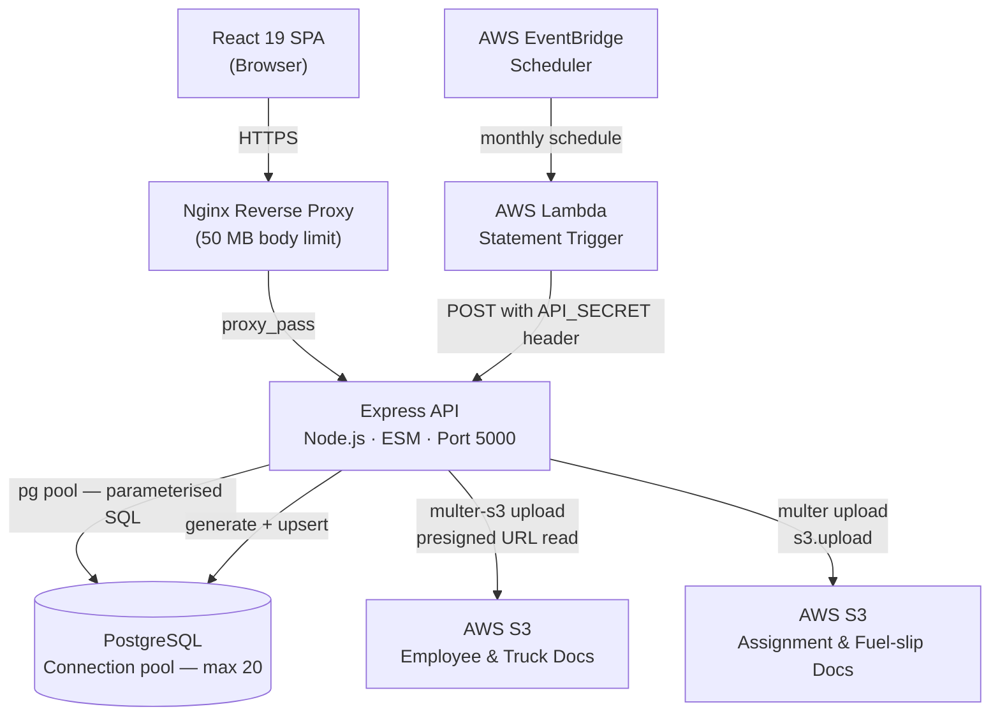

# Trucking Logistics Management Platform

## 1. System Overview

A full-stack operations and financial management platform built for a logistics client, covering the complete job lifecycle from instruction creation through invoicing, payment allocation, and monthly financial reporting. The system manages multiple actor roles (controllers, finance clerks, directors, subcontractors) across a shared PostgreSQL database, with document storage in S3 and automated monthly statement generation driven by AWS EventBridge.

---

## 2. Architecture Diagram



**Request lifecycle (authenticated API call):**
1. Browser sends `Authorization: Bearer <jwt>` with every request after login.
2. Nginx forwards to Express on port 5000.
3. `verifyToken` middleware validates the JWT against the process-lifetime secret.
4. Controller calls the model layer, which executes a parameterised `pg` query.
5. Response JSON is returned; for document access, a time-limited S3 presigned URL is generated server-side and returned to the client.

**Scheduled statement generation:**
EventBridge fires a Lambda on the 1st of each month. Lambda calls `POST /api/statements/generate` with an `API_SECRET` bearer token. Express authenticates the token separately from the user JWT path and runs `generateMonthlyStatements()` inside a single PostgreSQL transaction.

---

## 3. Tech Stack

| Layer | Technology | Rationale |
|---|---|---|
| Frontend framework | React 19 | Concurrent rendering features; stable ecosystem for a data-heavy internal tool |
| Routing | React Router v7 | File-based layout with nested routes; matches the role-scoped page hierarchy |
| Styling | Tailwind CSS v4 | Utility-first avoids a growing custom CSS surface; co-located styles reduce context switching |
| Animation | Framer Motion | Declarative transitions for modals and page entries without hand-writing CSS keyframes |
| Charts | Recharts + Chart.js / react-chartjs-2 | Recharts for composable data viz; Chart.js for specific chart types not covered by Recharts |
| PDF generation | jsPDF + jspdf-autotable + html2pdf.js | Client-side PDF rendering for tax invoices and wage slips without a server-side PDF service |
| Excel export | ExcelJS | Structured `.xlsx` export for financial reports |
| HTTP client | Axios | Interceptors used for attaching the JWT header globally |
| Backend framework | Express.js | Minimal, well-understood; appropriate for a structured REST API without GraphQL complexity |
| Authentication | Passport.js (LocalStrategy) + JWT | Passport handles interactive session login; JWT middleware handles stateless API calls from the SPA |
| Password hashing | bcrypt (cost 10) | Industry-standard adaptive hashing; cost factor configurable |
| Security headers | Helmet | Sensible header defaults in one line; CSP disabled because the server serves the CRA build with an inlined runtime chunk |
| Rate limiting | express-rate-limit | Applied to the auth routes specifically — brute-force protection where it matters, without throttling normal API use |
| Request validation | Zod | Schema validation on the financially material write endpoints; coerces the string-typed numbers browsers send |
| CI/CD | GitHub Actions → AWS Elastic Beanstalk | Push-to-deploy per branch (`staging`, `main`), building client and server into a single versioned artifact |
| Database | PostgreSQL | Strong support for JSONB, array types, and window functions required by the analytics queries |
| Database client | node-postgres (`pg`) — raw SQL | Complex CTEs and lateral joins in the analytics layer are easier to write and reason about in raw SQL than in a query builder |
| File storage | AWS S3 (af-south-1) | Durable object storage for compliance documents; presigned URLs keep credentials server-side |
| File upload middleware | multer-s3 / multer | Streams multipart uploads directly to S3 without buffering to disk |
| Scheduled jobs | AWS Lambda + EventBridge Scheduler | Decouples the monthly statement generation schedule from the application process, so a restart or deploy does not cause a missed run |
| Reverse proxy | Nginx (AWS Elastic Beanstalk `.platform`) | Handles TLS termination and the 50 MB body limit needed for document uploads |
| Runtime module system | ESM (`"type": "module"`) | Consistent module syntax across client and server; avoids CommonJS/ESM interop friction |

---

## 4. Architecture Decisions

Each decision below states what was chosen, what else was on the table, the reason, and what it costs. Where a choice has a known downside still live in the codebase, it is written down rather than omitted.

---

**Decision:** PostgreSQL as the system of record, rather than DynamoDB or another NoSQL store.

**Alternatives considered:** DynamoDB (the default choice given the rest of the stack is AWS), MongoDB.

**Why this approach:** The access patterns here are the ones relational databases exist for, and they are not known in advance:

- **The domain is inherently relational.** The schema is 31 tables with 33 foreign-key relationships. An instruction has legs, legs have trucks and drivers, trucks have documents, an instruction produces an invoice, invoices are partially settled by payments, payments roll into statements. Modelling that in DynamoDB means either duplicating data across item collections or doing the joins in application code.
- **Analytics queries are ad-hoc and aggregate-heavy.** `models/analytics/analyticsModel.js` is ~1,500 lines of SQL using CTEs, lateral joins, and window functions (42 occurrences of `WITH` / `JOIN LATERAL` / `OVER (` / `GROUP BY` in that one file). Revenue attribution across multi-leg instructions divides `total_cost` by a leg count and a per-leg truck count computed in sibling CTEs. DynamoDB has no joins, no aggregation, and no ad-hoc query capability — this would become a second analytics pipeline (stream → warehouse) to answer questions the database already answers directly.
- **Money requires multi-row transactions.** Statement generation writes an aging-analysis row and a statement row per client across the entire client list inside a single `BEGIN`/`COMMIT`, rolling back the whole run on any failure (`utils/statementGenerator.js:337`). DynamoDB transactions cap at 100 items and cannot span an unbounded client list.
- **Financial correctness needs exact numerics.** `NUMERIC(12,2)` for currency, with `pg` type parsers overridden in `config/database.js` so values do not silently become floats. DynamoDB stores numbers as strings with its own precision rules and no server-side decimal arithmetic.
- **Date arithmetic runs in the query.** Aging buckets, point-in-time rate lookups (`effective_from <= :date ORDER BY effective_date DESC LIMIT 1`), and VAT-period reporting are all date-range predicates the database evaluates against indexes.

The scale argument that usually favours DynamoDB does not apply: this is an internal tool for one logistics operator with tens of users and a query volume a single `db.t3` instance absorbs without effort. Choosing DynamoDB would have traded away everything above to solve a scaling problem the system does not have.

**Trade-offs:** A relational database is a vertical-scaling bottleneck and a single point of failure — the connection pool is capped at 20 and would need pgBouncer or a read replica before horizontal scaling. Schema changes require migrations (seven applied so far in `server/migrations/`), where DynamoDB would have absorbed new attributes without one. Operationally, RDS costs more at idle than DynamoDB's on-demand pricing at this volume.

---

**Decision:** Raw `pg` queries throughout; no ORM.

**Alternatives considered:** Prisma, Sequelize, Drizzle ORM — all would have provided a typed schema, migration runner, and relation helpers.

**Why this approach:** The analytics layer requires multi-CTE queries that attribute instruction revenue across legs proportionally (`total_cost / num_legs / trucks_per_leg`), lateral joins to explode JSONB arrays, and window functions for container rate resolution. These are straightforward in SQL and become unwieldy or require raw-query escape hatches in most ORMs, which negates the benefit.

**Trade-offs:** No automated migration framework — schema changes are manually written `.sql` files applied directly. No compile-time type safety on query results. The pool is capped at 20 connections, which is adequate for the current load but would need review before horizontal scaling.

---

**Decision:** JSONB `line_items` array on the payments table (`payment_m3`) rather than a normalised `payment_line_items` child table.

**Alternatives considered:** Separate table with `payment_id` foreign key and one row per payment application date.

**Why this approach:** A payment in this domain can allocate amounts across multiple invoice dates in a single transaction. Storing these as an embedded JSONB array matches the natural write unit (one payment event with several line applications) and avoids a join for the common case of reading a payment in full. Aggregation uses `CROSS JOIN LATERAL jsonb_array_elements(p.line_items) AS item` to extract individual applications for analytics queries.

**Trade-offs:** Aggregating across large payment volumes requires lateral joins that are more expensive than indexed FK lookups. Individual line items cannot be independently indexed or constrained at the database level.

---

**Decision:** Monthly statement aging is recomputed from live outstanding items at generation time, not derived from stored invoice totals.

**Alternatives considered:** Carry-forward: take the previous statement's closing balance and add/subtract the month's activity.

**Why this approach:** Carry-forward compounds any data errors month-over-month and makes backdated corrections difficult to reconcile. The current approach queries `m1_controller` (outstanding instructions) and `add_ons` (outstanding ad-hoc charges) with a `payment_status IN ('unpaid', 'partial')` filter and ages each item against the generation date, so the statement is always a true point-in-time snapshot of what is actually owed, not an accumulated ledger.

**Trade-offs:** More expensive to generate (two queries per client per month plus a previous-statement lookup for opening balance). If an instruction's payment status is incorrectly set, it propagates into every subsequent statement until corrected.

---

**Decision:** Month-end statement generation is triggered by EventBridge Scheduler → Lambda → an authenticated HTTP endpoint, rather than by an in-process cron job.

**Alternatives considered:** `node-cron` inside the Express process (this was the original implementation; the dependency has since been removed); a manual "generate statements" button in the finance UI.

**Why this approach:** The trigger is the one part of this feature that must not depend on the application being alive at a specific instant.

- **In-process cron misses the run if the process is not up at that moment.** Statement generation fires once a month, on the 1st. A deploy, a crash, an Elastic Beanstalk instance replacement, or an autoscaling event at that moment silently skips the run — and nothing surfaces the miss until a client asks where their statement is. EventBridge holds the schedule outside the application entirely, so the application's uptime at 00:00 on the 1st stops being a correctness dependency.
- **A cron inside the app breaks the moment there is more than one instance.** With `node-cron`, every running instance fires its own timer, so scaling to two instances means generating every statement twice. EventBridge fires once regardless of how many instances are behind the load balancer — the schedule stops being coupled to the deployment topology.
- **It gets retries and failure visibility for free.** EventBridge retries the Lambda on failure and can route exhausted attempts to a dead-letter queue; the run is observable in CloudWatch without building any of that into the app.
- **The work stays in the application.** The Lambda is a trigger, not an implementation — it calls `POST /api/statements/generate` and the generation logic lives in `utils/statementGenerator.js`, next to the models and the pool it depends on. The same endpoint backs the manual regeneration path in the finance UI, so the scheduled and manual routes exercise identical code rather than drifting apart.
- **Re-firing is safe.** `processClient()` looks up an existing statement for the period and updates it in place instead of inserting a duplicate, and the whole run is wrapped in one transaction that rolls back on any error. A retry, a duplicate delivery, or an operator regenerating a past month all converge on the same result rather than compounding.

The endpoint authenticates the Lambda with a shared `API_SECRET` bearer token, checked before the JWT path — which is why `statementRoutes` is mounted *above* the global `verifyToken` guard in `routes/index.js:54`, so a non-JWT token is not rejected before reaching its own check.

**Trade-offs:** Adds AWS resources that live outside the repo — the schedule and the Lambda are not version-controlled with the application, so the deployment is no longer fully described by this codebase. `API_SECRET` is a symmetric shared secret: anyone holding it can trigger arbitrary statement regeneration, and rotating it requires a coordinated change in both the Lambda's environment and the server's. Local development cannot exercise the scheduled path end-to-end; it is tested by calling the endpoint directly.

---

**Decision:** Driver rate table (`m5_driver_rate`) extended with `effective_from` / `effective_to` date columns for rate versioning.

**Alternatives considered:** A separate rate history table; event sourcing; keeping only the current rate and accepting that historical leg calculations could be wrong after a rate change.

**Why this approach:** Transport rates change periodically but historical invoices must be reproducible at the rate that was in effect when the leg ran. The migration added `effective_from DATE NOT NULL DEFAULT '2020-01-01'` (making all existing rates valid from the start of recorded history) and a nullable `effective_to`. A composite index on `(startingpoint, destination, effective_from)` makes the date-range lookup efficient. The default ensures full backward compatibility with existing legs.

**Trade-offs:** The application is responsible for enforcing non-overlapping date ranges — there is no database constraint preventing two rates for the same route with overlapping periods. Queries must `ORDER BY effective_from DESC LIMIT 1` to resolve the applicable rate, and must be correct about the comparison date.

---

**Decision:** JWT secret generated with `crypto.randomBytes(64)` at process startup in `config/secrets.js`, rather than reading a static secret from an environment variable.

**Alternatives considered:** Read `JWT_SECRET` from the environment (the `.env` file contains this key but `secrets.js` ignores it).

**Why this approach:** This was likely an early development choice to avoid committing a real secret. The effect is that every server restart issues a new signing secret and all previously issued JWTs become invalid immediately.

**Trade-offs:** Every deployment or crash invalidates all active user sessions, requiring users to log in again. This is a known limitation. The `.env` `JWT_SECRET` key is currently dead code — switching to it would require one line change in `secrets.js` and would make sessions survive restarts.

---

**Decision:** Authentication is enforced by a single global guard mounted in the central router, with public routes deliberately mounted above it.

**Alternatives considered:** Applying `verifyToken` per route or per router module.

**Why this approach:** Per-route middleware fails open — a new route added without the middleware is public, and nothing catches it. Mounting `router.use(verifyToken)` once in `routes/index.js` after the public block inverts that: a newly added route module is authenticated by default, and making something public requires a deliberate edit above the guard line with a comment explaining why. There are four such exceptions (auth, landing stats, the health check, and the statement generation route with its own `API_SECRET` check), each annotated in place. The frontend mirrors this with `RequireAuth` / `RequireRole` wrappers, but the server guard is the enforcement point — the client-side check is a UX affordance, not a security control.

**Trade-offs:** Ordering in `routes/index.js` is now load-bearing. Moving a `router.use()` line across the guard silently changes the security posture of every route in that module, and nothing in the type system or tests catches it. The guard also forces the SPA's static assets to be served *before* the API router in `server.js:185`, since otherwise browser navigations would receive a `401 NO_TOKEN` JSON body instead of the React shell.

---

**Decision:** Zod validation applied selectively to financially material write endpoints, using `.passthrough()`, rather than full schema coverage of every request.

**Alternatives considered:** Validating every endpoint with strict schemas; no validation beyond parameterised SQL.

**Why this approach:** The endpoints where a malformed payload causes real damage are a small, identifiable set — payment creation, invoice creation, credit notes, and the pricing fields on instruction save. Those get schemas in `validation/financialSchemas.js`, with coercion for the string-typed numbers browsers actually send and rejection of non-positive amounts. `.passthrough()` is deliberate: the instruction payload is large and mostly non-financial, and a strict schema would have to enumerate every field the models read, turning validation into a maintenance burden that grows with every UI change. The intent is a safety net over the fields where correctness is money, not a whitelist over the whole API.

**Trade-offs:** Endpoints outside this set rely on parameterised SQL and database constraints alone — SQL injection is prevented, but a type-confused or out-of-range value can still reach a table. `.passthrough()` means unrecognised fields are not rejected, so a client typo in a field name fails silently rather than erroring.

---

**Decision:** PDF and Excel documents are generated in the browser (jsPDF, ExcelJS), not on the server.

**Alternatives considered:** A server-side rendering service (Puppeteer/headless Chrome, or a PDF microservice) producing documents on demand.

**Why this approach:** Tax invoices, wage slips, and financial exports are generated interactively, one at a time, by a user looking at the data on screen. Rendering client-side means the document is built from the exact view state already loaded — no second serialisation path that can drift from what the user saw — and it keeps headless Chrome, its memory footprint, and its cold-start latency off an Elastic Beanstalk instance that is also serving the API. The document never round-trips, so there is no temporary file to store or clean up, and no generation queue to operate.

**Trade-offs:** Documents cannot be produced without a browser session, which rules out emailing a statement PDF from a scheduled job or the Lambda path — that is why statement generation writes rows to the database rather than producing files. Output fidelity depends on the client's browser, and large exports are bounded by the user's machine. Bulk generation (every wage slip for a month) is not possible in one operation.

---

**Decision:** Documents in S3 are read through short-lived presigned URLs generated server-side, rather than proxied through the API or served from a public bucket.

**Alternatives considered:** Streaming the object through an authenticated Express route; making the bucket publicly readable with unguessable keys.

**Why this approach:** Compliance documents (driver licences, truck roadworthy certificates, fuel slips) are personal and regulatory records — a public bucket is not an option regardless of key entropy. Proxying through Express would work but puts every document byte through the application process and the 50 MB Nginx body limit, consuming request capacity on an instance sized for JSON traffic. Presigned URLs let the browser fetch directly from S3 while the authorisation decision stays server-side: the API checks the user's role, then mints a time-limited URL. AWS credentials never reach the client.

**Trade-offs:** A presigned URL is a bearer token for that object until it expires — if a user forwards one, the recipient needs no login. Access to the object itself is therefore not audited; only the URL issuance is visible to the application. Buckets use separate IAM credential pairs per purpose (employee docs, truck docs, ops docs), which limits blast radius but means three sets of keys to rotate.

---

**Decision:** The React build is folded into the Express server and shipped as one Elastic Beanstalk artifact per environment, deployed by GitHub Actions on push.

**Alternatives considered:** Static frontend on S3 + CloudFront with the API deployed separately; containerised deployment.

**Why this approach:** One artifact means the frontend and the API it talks to are always the same version — there is no window where a newly deployed client calls an endpoint the server does not have yet, which is the standard failure mode of independently deployed frontends. It also removes CORS from production entirely (same origin), leaving it as a development-only concern for the `localhost:3000` dev server. The `staging` and `main` branches map to separate Elastic Beanstalk environments with their own workflow files, so staging is a genuine pre-production rehearsal of the same artifact shape.

**Trade-offs:** Static assets are served by the application instance rather than a CDN, so there is no edge caching and a frontend-only change requires a full application redeploy. Push-to-deploy on `staging` and `main` means those branches are live by definition — there is no approval gate between merge and deploy. Because the deployed server serves the CRA build with its inlined runtime chunk, `helmet`'s Content-Security-Policy is disabled (`server.js:33`), giving up CSP protection that a separately hosted frontend could have kept.

---

**Decision:** The audit trail is produced by one global middleware that records every state-changing request, rather than by an audit call inside each controller.

**Alternatives considered:** Hand-written `auditFromReq()` calls in every handler; database triggers on each audited table.

**Why this approach:** Per-controller calls only cover the handlers someone remembered to instrument, and the gaps are invisible — an audit log that is silently partial is worse than none, because absence of a row reads as absence of an action. `server/middleware/auditTrail.js` sits ahead of the auth guard in `routes/index.js` and hooks `res.on("finish")`, so it captures the actor, target, request payload, status and outcome for every POST/PUT/PATCH/DELETE, including the ones that were rejected with a 401/403 or failed with a 500. `server/config/auditActions.js` maps routes to business action names; a route that is not mapped is still recorded, under `UNMAPPED_<METHOD>`, so adding an endpoint can never quietly drop it out of the trail. Database triggers would cover writes from any source but see rows, not intent — no actor, no IP, no request context, and no record of an attempt that was denied before it reached SQL.

**Trade-offs:** One extra INSERT per mutating request (fire-and-forget: an audit failure logs and is swallowed rather than failing the user's operation). Request payloads are stored, so `sanitise()` in the middleware redacts anything key-matching `password|token|secret|…` and clips long values — a new secret-bearing field name has to be added to that pattern. Reads are only audited where explicitly registered as `sensitive` (payroll, document downloads, financial reports, the audit log itself); auditing all reads was rejected as volume without forensic value. Where a controller writes its own richer entry it sets `req.auditLogged`, and the middleware stands down for that request's success path.

**Keeping the viewer fast as the table grows.** Full coverage means the table grows without bound — roughly 355 MB per million rows (244 MB heap, 111 MB indexes). The page query itself is never the problem; the queries wrapped around it are. Three things keep a page load flat rather than linear in table size:

- **No `SELECT DISTINCT` per request.** The filter dropdowns are served from `config/auditActions.js`, with a 15-minute cached scan only to pick up action types in old rows that the registry no longer lists. Measured at 1M rows, the two DISTINCT scans cost 271 ms on every page load before this.
- **Capped count.** The pager counts at most 20 000 matching rows (`LIMIT` inside a subquery) and the viewer renders "more than 20 000 — narrow the date range". An exact `COUNT(*)` is a full scan that costs the same on page 1 as on page 400: 87 ms at 1M rows, 1 ms capped.
- **A default 30-day window** in the viewer, so every query rides a `(filter, timestamp)` index instead of scanning history. Clearing the from-date still searches everything. At 1M rows all four filtered views are backward index scans under 0.3 ms; the unindexable `ILIKE` search drops from 459 ms to 49 ms inside the window.

Retention is a deliberate operator decision rather than an automatic one — `server/scripts/pruneAuditLog.js` reports what a horizon would remove and only deletes with `--apply`, keeping login failures and password changes regardless of age unless asked otherwise.

---

## 5. System Design Highlights

- **Proportional revenue attribution across multi-leg instructions.** The analytics queries compute per-truck and per-subcontractor turnover by splitting `m1_controller.total_cost` using two CTEs: one to count distinct legs per instruction, one to count distinct trucks per leg. The final division (`total_cost / num_legs / trucks_per_leg`) distributes revenue without double-counting when multiple trucks share a single leg or a single instruction spans multiple legs. This runs as a single query over the `legs_m2` join with `m1_controller`.

- **Point-in-time payroll with temporal deduction history.** Wage calculations look up the employee's applicable deductions and base salary from history tables (`employee_deduction_history`, `base_salary_history`) using the last day of the target month as the cutoff — `WHERE effective_date <= last_day_of_month ORDER BY effective_date DESC LIMIT 1`. This means a historical wage slip remains accurate after a pay change because it resolves against the rates that were in effect at the time, not the current values.

- **Invoice date derived from transport activity, not creation timestamp.** When an invoice is generated for an instruction, the invoice date is set to `MIN(legs_m2.date) WHERE legnumber = 1` — the earliest date on which the first leg of that instruction ran. This anchors the invoice to when the service was actually delivered, which matters for VAT period reporting and aging analysis.

- **Dual user table authentication with session type tagging.** Login searches `usertable` first, then `m5_employee`, and tags the session object with a `table` field indicating which table the user came from. `deserializeUser` and `findUserById` both branch on this field. This allows company-owner accounts and employee accounts to share the login flow while living in separate tables with different schemas, and preserves the ability to move them apart or merge them without changing the auth middleware.

---

## 6. Setup and Running Locally

### Prerequisites

- Node.js 20+
- npm 10+
- PostgreSQL 15+

### Install

```bash
# From the repo root
npm install
npm install --prefix client
npm install --prefix server
```

### Environment variables

Create `server/.env`:

```env
# PostgreSQL
POSTGRES_USER=your_db_user
POSTGRES_HOST=localhost
POSTGRES_DB=your_db_name
POSTGRES_PASSWORD=your_db_password
POSTGRES_PORT=5432
DB_SSL=                         # set to "true" for RDS with SSL

# AWS — employee document bucket
Employee_AWS_BUCKET_NAME=your-employee-bucket
Employee_AWS_ACCESS_KEY_ID=AKIA...
Employee_AWS_SECRET_ACCESS_KEY=...

# AWS — truck and trailer document bucket
Trucks_AWS_BUCKET_NAME=your-trucks-bucket
Trucks_AWS_ACCESS_KEY_ID=AKIA...
Trucks_AWS_SECRET_ACCESS_KEY=...

# AWS — assignment and fuel-slip docs (shared bucket, v2 SDK)
AWS_REGION=af-south-1
AWS_ACCESS_KEY_ID=AKIA...
AWS_SECRET_ACCESS_KEY=...
S3_BUCKET_NAME=your-ops-bucket

# Statement generation — used by the Lambda trigger
API_SECRET=a-long-random-secret-shared-with-the-lambda

# Application
NODE_ENV=development
PORT=5000
```

`client/.env` (optional — the client proxies to `localhost:5000` via `package.json`):

```env
REACT_APP_API_URL=http://localhost:5000
```

### Apply database migrations

```bash
psql -U your_db_user -d your_db_name -f server/migrations/001_add_effective_dates_to_driver_rates.sql
psql -U your_db_user -d your_db_name -f server/migrations/002_add_unique_orderno_to_expenses_m2.sql
psql -U your_db_user -d your_db_name -f server/migrations/003_link_addon_instruction_to_invoice.sql
psql -U your_db_user -d your_db_name -f server/migrations/004_add_dn_to_legs_m2.sql
psql -U your_db_user -d your_db_name -f server/migrations/005_add_fuel_surcharge_to_client_rate.sql
psql -U your_db_user -d your_db_name -f server/migrations/006_extend_audit_log.sql
psql -U your_db_user -d your_db_name -f server/migrations/007_cascade_repair_and_fk_indexes.sql
psql -U your_db_user -d your_db_name -f server/migrations/008_audit_log_full_coverage.sql
```

### Run

```bash
# Both client (port 3000) and server (port 5000) concurrently
npm start

# Server only
npm run server

# Client only
npm start --prefix client
```

---

## 7. Project Structure

```
.
├── client/                      # React 19 SPA
│   └── src/
│       ├── App.jsx              # Root router — ~55 named routes, role-scoped
│       ├── context/
│       │   └── AuthContext.js   # JWT storage and token expiry notification
│       ├── hooks/               # Extracted instruction form hooks (refactored)
│       │   ├── useInstructionData.js      # Data fetching lifecycle, route mismatch
│       │   ├── useContainerManagement.js  # Container state, deletion flow
│       │   ├── useRateManagement.js       # Rate fetching, lock state, cost calc
│       │   └── useWeightRows.js           # Break-bulk weight row state
│       ├── pages/               # Route-level components, grouped by domain
│       │   ├── instructions/    # Create / update / view instruction flows
│       │   ├── invoices/        # Invoice list and detail with PDF export
│       │   ├── statements/      # Monthly client statements
│       │   ├── analytics/       # Director analytics dashboard
│       │   ├── Reports/         # P&L, wage, VAT recon, subbie commission
│       │   ├── wages/           # Payroll and wage slip generation
│       │   ├── Creditors/       # Purchase orders, subcontractor statements
│       │   └── user_menus/      # Role-based dashboards
│       └── api.js               # Axios instance with JWT interceptor
│
├── server/
│   ├── server.js                # Entry point — Express setup, Passport config, session
│   ├── config/
│   │   ├── database.js          # pg Pool, type parser overrides (NUMERIC, DATE)
│   │   └── secrets.js           # JWT secret — crypto.randomBytes(64) at startup
│   ├── middleware/
│   │   └── auth.js              # verifyToken (JWT) + verifyAdminAccess (roleid=7)
│   ├── routes/
│   │   └── index.js             # Central router — mounts ~35 route modules
│   ├── controllers/             # Request handlers, one directory per domain
│   ├── models/                  # SQL query functions, one directory per domain
│   │   ├── analytics/           # CTE-heavy revenue attribution queries
│   │   ├── invoices/            # Invoice creation, container rate resolution
│   │   └── wages/               # Point-in-time payroll calculation
│   ├── utils/
│   │   ├── statementGenerator.js           # Monthly client statement generation
│   │   ├── subcontractorStatementGeneration.js  # Monthly subcontractor statements
│   │   ├── wagesUtils.js                   # Tax bracket lookup, deduction history
│   │   ├── s3Config.js                     # multer-s3 config for employee/truck docs
│   │   ├── dbUtils.js                      # S3 path helpers for ops docs
│   │   └── auditLogger.js                  # Audit log writes (generic + transactional)
│   ├── migrations/
│   │   ├── 001_add_effective_dates_to_driver_rates.sql
│   │   └── 002_add_unique_orderno_to_expenses_m2.sql
│   └── scripts/
│       ├── backfillSubcontractorStatements.js  # CLI backfill — single month or --range
│       └── pruneAuditLog.js                 # Audit retention — dry run unless --apply
│
└── .platform/
    └── nginx/conf.d/
        └── client_max_body_size.conf   # 50 MB — required for PDF/document uploads
```
